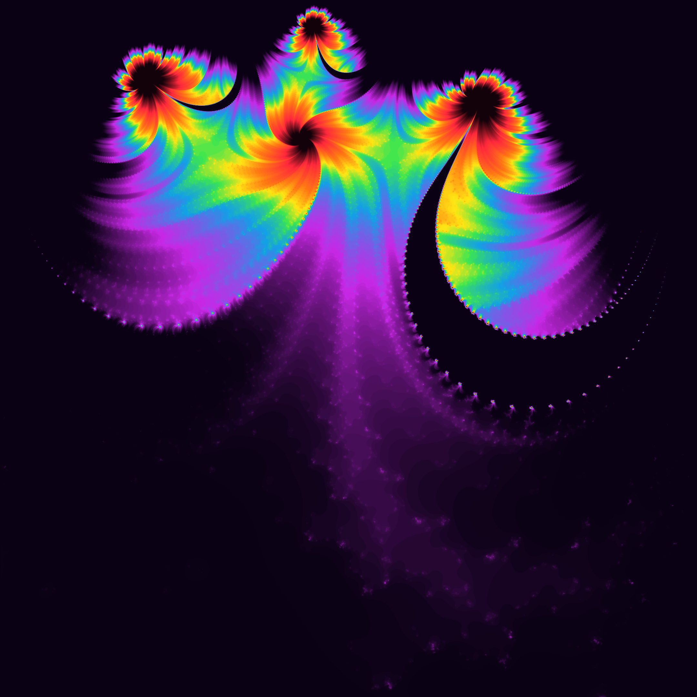
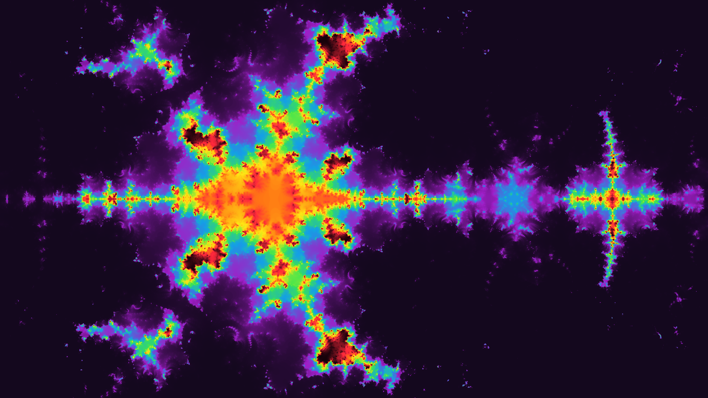
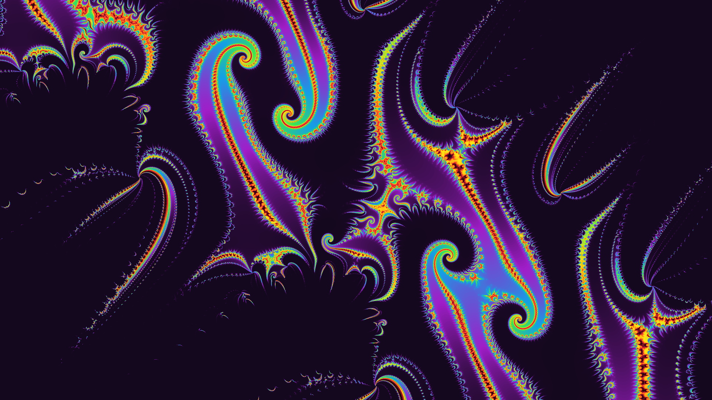
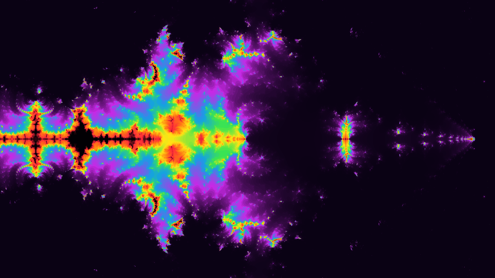
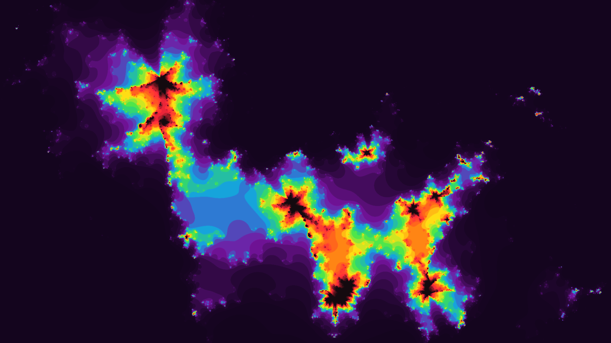
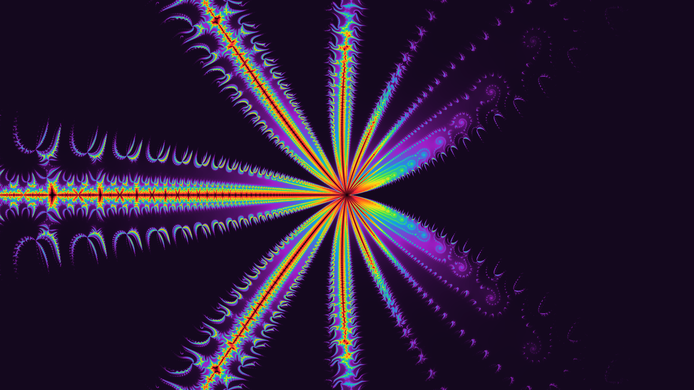

# Fractal Renderer

This is a very simple program used to render fractals using a parameter json file.

It includes different fractal kinds among which the Mandelbrot set and a (potentially new) kind of fractal I came up with by using second- and third-degree recursive sequences instead of the classic first-degree recursive pattern used to draw the Mandelbrot set..

It uses cumulative histogram coloring, but I would like to combine it with another technique to improve its appearance in areas with fewer details. In such cases, the current method tends to produce awkwardly flat patterns.

# How to use

Create a json file that must have the following structure:

```jsonc
{
  "img_width": ..., // make the image as big as you want (not too big tho)
  "img_height": ...,
  "zoom": 1., // zoom into the fractal by decreasing this
  "center_x": 0.0, // change this...
  "center_y": 0.0, // ... and this to change the render position
  "max_iter": 3000, // change max iteration count
  "oversampling": true, // reduces the amount of "random" pixels from being colored
  "fractal_kind": ..., // this is the fractal kind (see presets)
  "coloring_mode": "CumulativeHistogram" // cumulative histogram recommended
}
```

Next, in order to render your fractal, run the following command:

```
cargo run -r -- <your param file path>.json <your output image path>.png
```

# Presets

### [ukhbrp.json](./presets/ukhbrp.json)



### [ebidxr.json](./presets/ebidxr.json)



### [mzfyje.json](./presets/mzfyje.json)



### [ztkhky.json](./presets/ztkhky.json)



### [hdihec.json](./presets/hdihec.json)



### [datgdv.json](./presets/datgdv.json)


