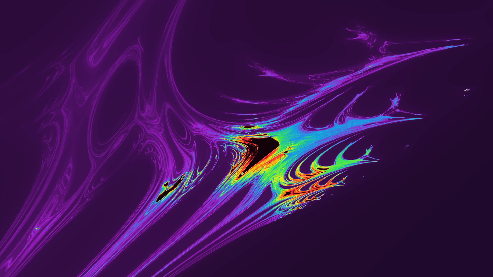
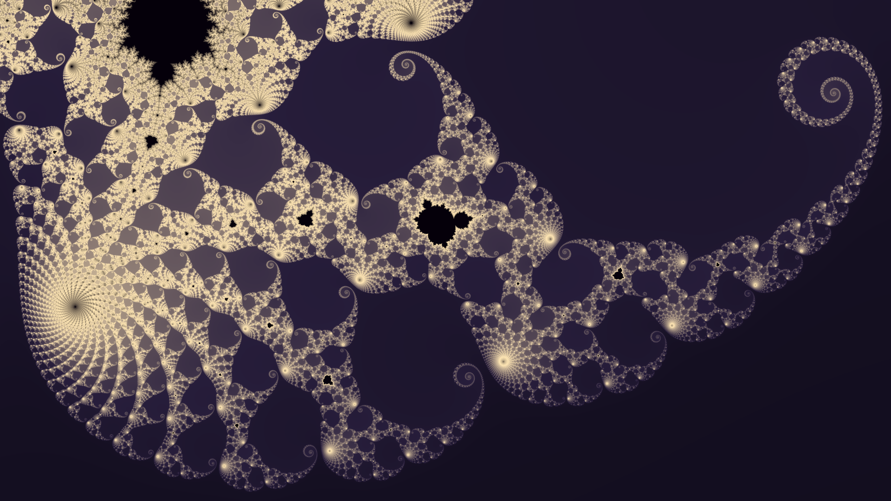
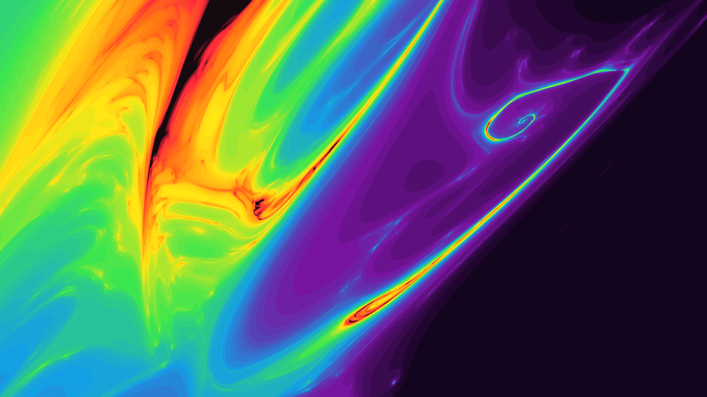
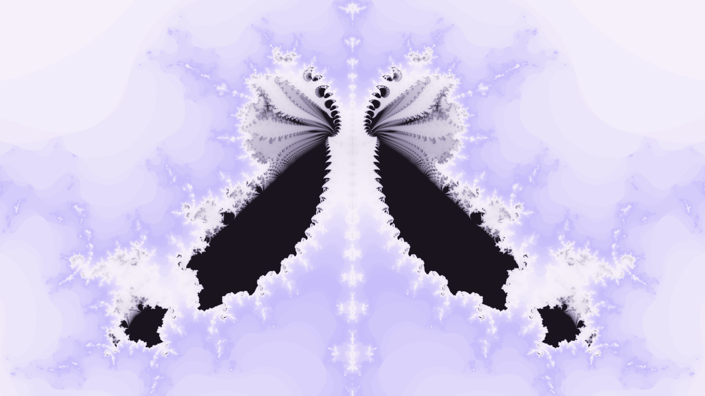

# Fractal Renderer

This is a program used to render fractals to images using a parameter [RON](https://docs.rs/ron/latest/ron/) file.

### Table of contents

- [Fractal Renderer](#fractal-renderer)
- [How to use](#how-to-use)
- [Preset renders](#preset-renders)

# How to use

First, download the latest executable from the [releases tab](https://github.com/valflrt/fractal_renderer/releases/latest).

Next, create a RON parameter file that with the following structure (see [parameter file reference](./REFERENCE.md)):

```rust
(
    img_width: 1920,
    img_height: 1080,
    render: Frame(
        zoom: 0.001,
        center_x: 0.0097,
        center_y: -0.01,
        fractal: SecondDegreeRecWithGrowingExponent,
    ),
    max_iter: 100000,
    coloring_mode: CumulativeHistogram(map: Powf(12)),
    sampling: (
        level: Ultra,
        random_offsets: true,
    ),
)
```

Then, in order to render your fractal, run the following command:

```
./fractal_renderer path/to/param_file.ron path/to/output_image.png
```

> [!NOTE]
> Supported image formats are png and jpg (extension used to guess image format)

Alternatively, if you have rust installed and downloaded this repository:

```
cargo run -r -- fractal.ron fractal.png
```

# Preset renders

These are preset renders I like, you can get their ron parameters files by clicking on the title. There are some more in [`presets/`](./presets/).

### [ukhbrp.ron](./presets/ukhbrp.ron)

> Fractal: `ThirdDegreeRecWithGrowingExponent`


### [ebidxr.ron](./presets/ebidxr.ron)

> Fractal: `ThirdDegreeRecWithGrowingExponent`


### [mzfyje.ron](./presets/mzfyje.ron)

> Fractal: `SecondDegreeRecWithGrowingExponent`


### [ecwfwb.ron](./presets/ecwfwb.ron)

> Fractal: `SecondDegreeRecWithGrowingExponentParam`

https://github.com/user-attachments/assets/a328b7b6-0e66-490a-9a35-ef8e93178f94

### [xvebhd.ron](./presets/xvebhd.ron)

> Fractal: `SecondDegreeRecWithGrowingExponent`


### [quhuap.ron](./presets/quhuap.ron)

> Fractal: `Iigdzh`


### [dvzrjn.ron](./presets/dvzrjn.ron)

> Fractal: `Iigdzh`



### [iabppp.ron](./presets/iabppp.ron)

> Fractal: `Mandelbrot`



### [ckvjjj.ron](./presets/ckvjjj.ron)

> Fractal: `SecondDegreeThirtySevenBlend`


### [phgzbz.ron](./presets/phgzbz.ron)

> Fractal: `SecondDegreeThirtySevenBlend`



### [gqwzzr.ron](./presets/gqwzzr.ron)

> Fractal: `ComplexLogisticMapLike`

https://github.com/user-attachments/assets/83793c10-4d2a-47f2-8e0b-7cee47c27e6b

### [dmgtyz.ron](./presets/dmgtyz.ron)

> Fractal: `SecondDegreeRecAlternating1WithGrowingExponent`


### [wztpft.ron](./presets/wztpft.ron)

> Fractal: `Vshqwj`



### [datgdv.ron](./presets/datgdv.ron)

> Fractal: `SecondDegreeRecWithGrowingExponent`


### [erbeap.ron](./presets/erbeap.ron)

> Fractal: `ThirdDegreeRecPairs`


