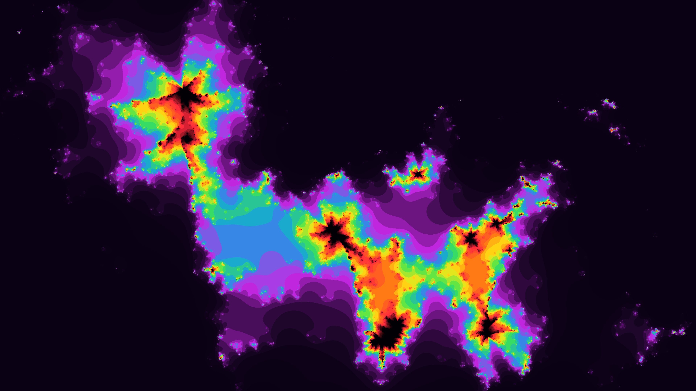
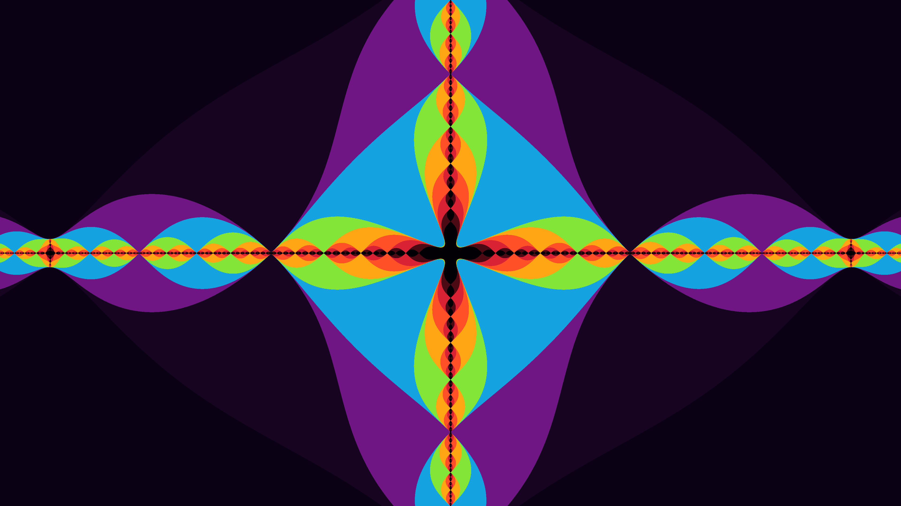

# Fractal Renderer

This is a very simple program used to render fractals using a parameter json file.

It includes different fractal kinds among which Mandelbrot and a (new ?) kind of fractal I came up with by using second/third degree recursive sequence instead of the classic first degree Mandelbrot.

# How to use

Create a json file that must have the following structure:

```jsonc
{
  "img_width": ..., // make the image as big as you want (not too big tho)
  "img_height": ...,
  "zoom": 1., // zoom into the fractal by decreasing this
  "center_x": 0.0, // change this...
  "center_y": 0.0, // ... and this to change the render position
  "max_iter": 3000, // change max iteration count
  "fractal_kind": "ThirdOrderGrowingExponent" // this is the fractal kind
}
```

Currently available fractal kinds are:

- `Mandelbrot`
- `SecondOrderGrowingExponent`
- `ThirdOrderGrowingExponent`

Next, to render your fractal, use: `cargo run -r -- <your param file path>.json <your output image path>.png`

# Examples


```jsonc
// fractals/gmawxkdrwbkd.json
{
  "img_width": 3840,
  "img_height": 2160,
  "zoom": 0.00026,
  "center_x": -0.11591,
  "center_y": 0.0,
  "max_iter": 3000,
  "fractal_kind": "ThirdOrderGrowingExponent"
}
```

#


```jsonc
// fractals/yjtzeggtvbcf.json
{
  "img_width": 3840,
  "img_height": 2160,
  "zoom": 0.001,
  "center_x": 0.0097,
  "center_y": 0.01,
  "max_iter": 3000,
  "fractal_kind": "SecondOrderGrowingExponent"
}
```

#



```jsonc
// fractals/qnkwncnmyftc.json
{
  "img_width": 3840,
  "img_height": 2160,
  "zoom": 0.0025,
  "center_x": -0.07238,
  "center_y": -0.0159,
  "max_iter": 3000,
  "fractal_kind": "ThirdOrderGrowingExponent"
}
```

#


```jsonc
// fractals/pafneiqccmnv.json
{
  "img_width": 3840,
  "img_height": 2160,
  "zoom": 0.1,
  "center_x": 0.0,
  "center_y": 0.0,
  "max_iter": 3000,
  "fractal_kind": "SecondOrderGrowingExponent"
}
```

#



```jsonc
// fractals/ftxuudxauwum.json
{
  "img_width": 3840,
  "img_height": 2160,
  "zoom": 1e-11,
  "center_x": -1.99988849682082,
  "center_y": 1e-16,
  "max_iter": 3000,
  "fractal_kind": "Mandelbrot"
}
```
