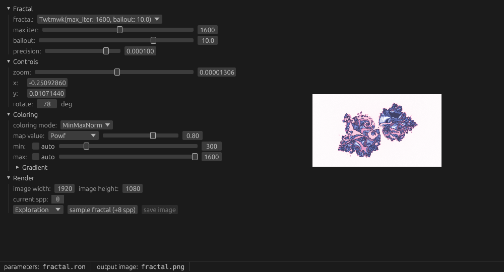

# Fractal Renderer

This is a program used to render fractals using a [RON](https://docs.rs/ron/latest/ron/) parameter file. It also has a simple GUI for easier navigation.

It features anti-aliasing and the GUI allows for progressive sampling by manually taking as many samples as necessary to smoothen the image.

### Table of contents

- [Fractal Renderer](#fractal-renderer)
- [How to install](#how-to-install)
- [How to use](#how-to-use)
- [Preset renders](#preset-renders)
- [Ideas](#ideas)
- [Notes](#notes)

# How to install

If you have [cargo](https://doc.rust-lang.org/cargo/) installed:

```
cargo install fractal_rndr
```

> You can also download executables [from github](https://github.com/valflrt/fractal_rndr/releases/latest).

# How to use

You can either directly run the executable or use the command line:

```
fractal_rndr path/to/param_file.ron path/to/output_image.png
```

> [!NOTE]
> Supported image formats are png and jpg (the extension is used to guess the format)

This is what the app looks like:



Enjoy !

# Preset renders

See [this repository](https://gitlab.com/valflrt/fractals).

# Alpha feature: animations

This software's parameter files can be used to render animation frames. But the gui does not support animation parameter files so animation rendering must be started using the cli :

```
fractal_rndr parameter_file.ron output_image.png --no-gui
```

> Output frames will be saved to `output_image_000000.png`, `output_image_000001.png`, ...

Here is an example of an animation parameter file :

```ron
Animation((
    img_width: 1920,
    img_height: 1080,
    zoom: AnimationSteps([SmoothExp(0, 8, 0.02, 0.00000003)]),
    center_x: AnimationSteps([Const(0, 8, -1.0095269995)]),
    center_y: AnimationSteps([Const(0, 8, -0.10252498565)]),
    rotate: Some(AnimationSteps([Const(0, 8, 2.3)])),
    fractal: ComplexLogisticMapLike(
        max_iter: 4000,
        a_re: AnimationSteps([Const(0, 8, -0.99900006)]),
        a_im: AnimationSteps([Const(0, 8, 0.10283586)]),
    ),
    coloring_mode: MinMaxNorm(
        min: Custom(300.0),
        max: Custom(4000.0),
        map: Linear,
    ),
    gradient: [
        (0.0, (255, 255, 255)),
        (0.3, (250, 182, 210)),
        (0.35, (213, 135, 193)),
        (0.5, (60, 60, 90)),
        (0.75, (105, 120, 198)),
        (1.0, (220, 210, 220)),
    ],
    sampling: (
        level: High,
        random_offsets: true,
    ),
    animation_cfg: Some((
    	duration: 8,
    	fps: 30,
    ))
))
```

To create a video from frames, you can use:

```bash
ffmpeg -framerate <fps> -pattern_type glob -i 'frames/*.png' -c:v libx264 -pix_fmt yuv420p video.mp4
```
