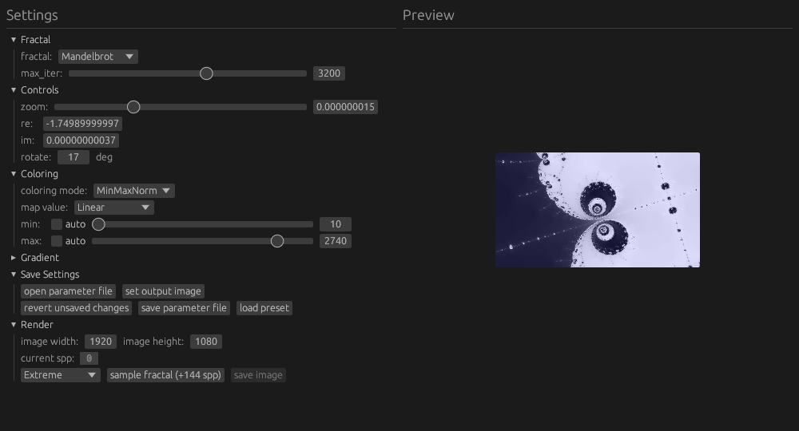

# Fractal Renderer

This is a program used to render fractals using a [RON](https://docs.rs/ron/latest/ron/) parameter file. It also has a simple GUI for easier navigation.

It features anti-aliasing and the GUI allows for progressive sampling by manually taking as many samples as necessary to smoothen the image.

### Table of contents

- [Fractal Renderer](#fractal-renderer)
- [How to install](#how-to-install)
- [How to use](#how-to-use)
- [Preset renders](#preset-renders)
- [Ideas](#ideas)
- [Notes](#notes)

# How to install

If you have cargo installed:

```
cargo install fractal_rndr
```

Otherwise, you can download the latest executable from the [releases tab](https://github.com/valflrt/fractal_rndr/releases/latest).

# How to use

You can either directly run the executable or use the command line:

```
fractal_rndr path/to/param_file.ron path/to/output_image.png
```

> [!NOTE]
> Supported image formats are png and jpg (the extension is used to guess the format)

This is what the app looks like:



Enjoy !

# Preset renders

See [this repository](https://gitlab.com/valflrt/fractals).

# Ideas

- use wgpu to perform calculations ? see [this](https://wgpu.rs/doc/src/wgpu_examples/repeated_compute/mod.rs.html#1-246)
- use opencl to perform calculations ? see [this](https://docs.rs/opencl3/latest/opencl3/)
- Make a new program using this one that is a purely gui program with progressive rendering
  - Progressive rendering ? Save a global `raw_image` and sample continuously from another thread to improve image quality
    - How to sample ? Use `Low` or `Medium` for first pass then do other passes with `High` (as the number of passes increases, the value of each pixel gets more and more accurate)
    - Careful: The average between new passes and the current values must be weighted: `(sampling_point_count_from_start * stored_value + sampling_point_count_for_current_pass * new_value) / (sampling_point_count_from_start + sampling_point_count_for_current_pass)`

# Notes

- To create a video from the frames:
  ```bash
  ffmpeg -framerate <fps> -pattern_type glob -i 'frames/*.png' -c:v libx264 -pix_fmt yuv420p video.mp4
  ```
